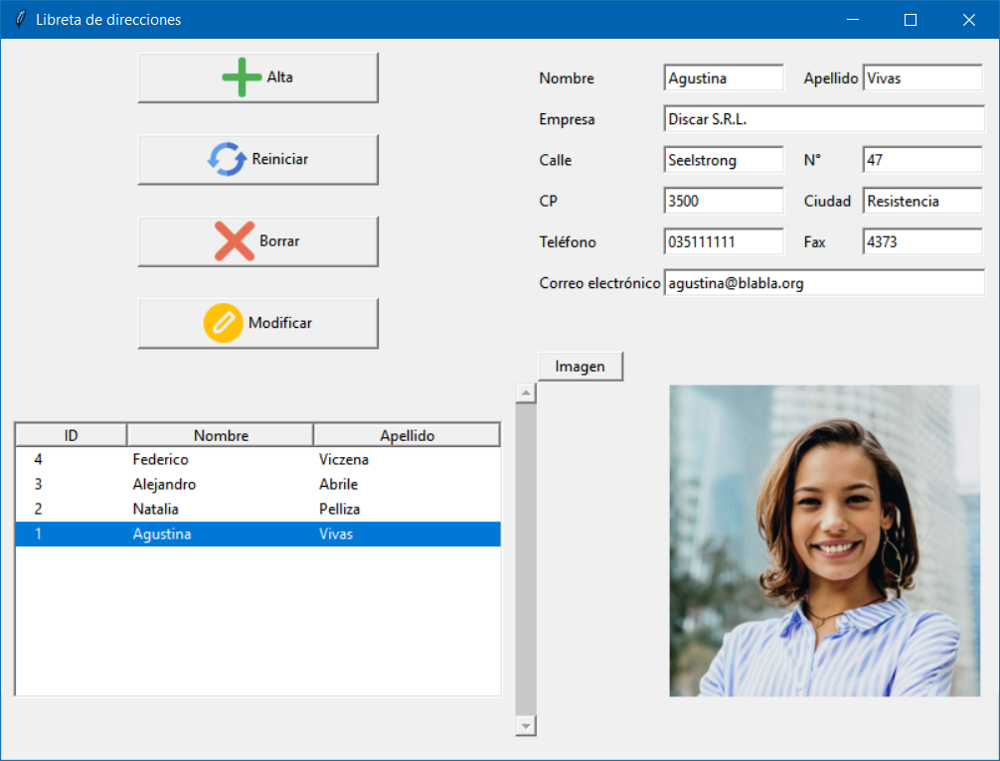

Instalación y uso
=================

El programa no requiere instalación.
Después de extraer los archivos del programa y cambiar al directorio del programa, el programa se inicia con el siguiente comando:
``python main.py``

Agregar un nuevo contacto
-------------------------
Introduzca los datos de un nuevo contacto en el campo superior derecho y seleccione una imagen pulsando el botón ``Imagen``.
Luego presiona el botón ``Alta`` y los datos serán agregados a la base de datos. 
El nombre y apellido del contacto aparecen en la lista de la parte inferior izquierda. 
Se deben completar al menos los campos de apellido y nombre. 
Además, se comprueba la corrección formal de la dirección de correo electrónico introducida. 

Consultar los datos de un contacto
----------------------------------
Para ver la información completa de un contacto existente, seleccione la persona en la lista en la parte inferior izquierda. 
Los datos se mostrarán entonces en los campos de la parte superior derecha. 

Borrar un contacto
------------------
Para eliminar un contacto existente y sus datos, seleccione la persona deseada en la lista en la parte inferior izquierda y luego presione el botón ``Borrar``. 
Después de una consulta, los datos están eliminados de la base de datos. 

Modificar los datos de un contacto
----------------------------------
Para cambiar los datos de un contacto existente, seleccione la persona deseada en la lista en la parte inferior izquierda. 
Luego modifica los datos en los campos de la parte superior derecha y finalmente presiona el botón ``Modificar``. 

Vaciar los campos en la parte superior derecha
----------------------------------------------
Los campos de la parte superior derecha se pueden vaciar en cualquier momento pulsando el botón ``Reiniciar``. 
Esto es útil, por ejemplo, antes de introducir los datos de un nuevo contacto.